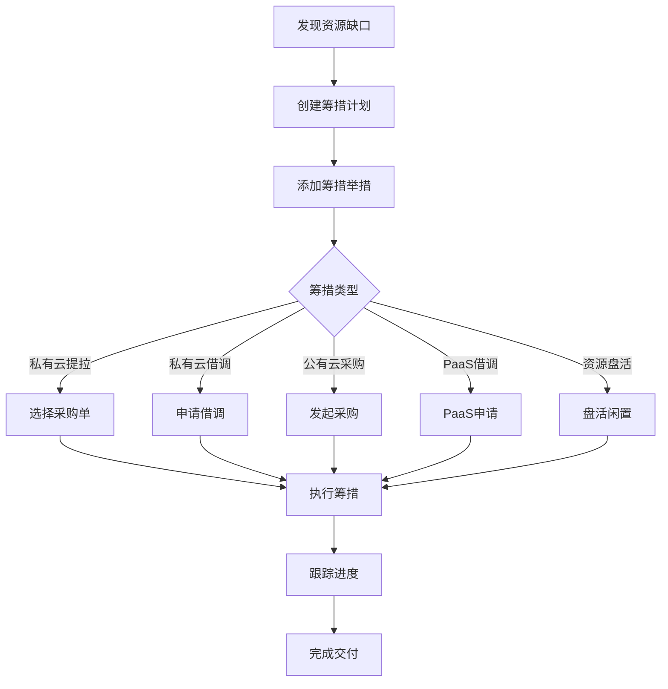
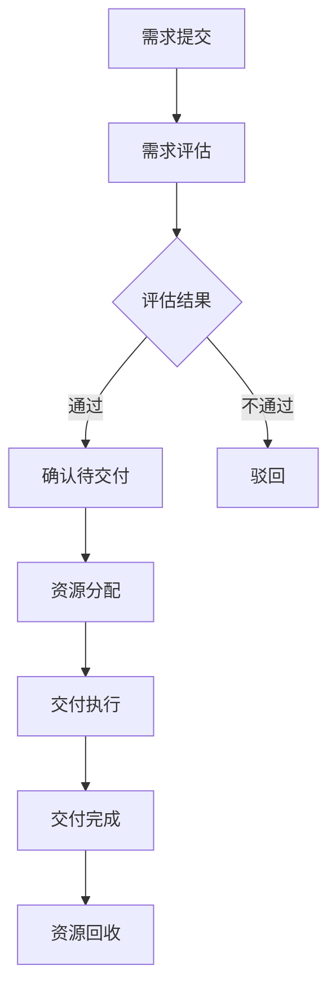

# 🚀 Hulk Match - 容器资源管理仪表板

[](https://github.com/tasyskybenjamin/Hulk_match)
[](https://reactjs.org/)
[](https://ant.design/)
[](LICENSE)

## 📋 项目概述

Hulk Match 是一个现代化的容器资源管理仪表板，专为企业级容器资源调度、需求管理和库存优化而设计。系统提供了全面的资源可视化、智能预测分析和高效的资源筹措管理功能。

### 🎯 核心价值

- **资源可视化**：实时展示容器资源分布、使用情况和趋势变化
- **智能预测**：基于历史数据和业务模式进行资源需求预测
- **高效筹措**：支持多种资源筹措方式，包括私有云提拉、公有云采购等
- **精准匹配**：智能匹配资源供需，优化资源配置效率

## 🏗️ 系统架构

### 技术栈

```
Frontend:
├── React 18.2.0          # 前端框架
├── Ant Design 5.0+       # UI组件库
├── ECharts 5.4.0         # 数据可视化
├── Day.js 1.11.0         # 日期处理
└── React Router 6.8.0    # 路由管理

Build Tools:
├── Create React App      # 脚手架工具
├── Webpack 5            # 模块打包器
└── Babel 7              # JavaScript编译器
```

### 目录结构

```
src/
├── components/           # 核心组件
│   ├── DemandManagementPage.js      # 需求管理主页面
│   ├── ResourceProcurementPage.js   # 资源筹措管理
│   ├── InventoryManagementPage.js   # 库存管理
│   ├── SupplyDemandSummary.js       # 供需总览
│   ├── AddMeasurePage.js            # 添加筹措举措
│   ├── EditMeasurePage.js           # 编辑筹措举措
│   ├── DemandDetailPage.js          # 需求明细
│   ├── DemandFilterPanel.js         # 需求筛选面板
│   ├── DemandDistributionChart.js   # 需求分布图表
│   └── DemandTrendChart.js          # 需求趋势图表
├── styles/               # 样式文件
├── utils/               # 工具函数
└── App.js               # 应用入口
```

## 🔧 核心功能模块

### 1. 供需总览 (SupplyDemandSummary)

#### 业务逻辑
- **实时监控**：展示当前资源供需状态的实时数据
- **趋势分析**：基于历史数据分析供需变化趋势
- **预警机制**：当供需失衡时触发预警提示

#### 功能实现
```javascript
// 供需平衡计算
const calculateSupplyDemandBalance = () => {
  const totalSupply = inventoryData.available + inventoryData.reserved;
  const totalDemand = demandData.pending + demandData.confirmed;
  const balanceRatio = totalSupply / totalDemand;

  return {
    status: balanceRatio >= 1.2 ? 'surplus' :
            balanceRatio >= 0.8 ? 'balanced' : 'shortage',
    ratio: balanceRatio,
    gap: totalDemand - totalSupply
  };
};
```

#### 核心指标
- **供给总量**：可用库存 + 预留资源
- **需求总量**：待处理需求 + 已确认需求
- **平衡指数**：供给总量 / 需求总量
- **缺口预警**：当平衡指数 < 0.8 时触发

### 2. 需求管理 (DemandManagementPage)

#### 业务逻辑
需求管理采用多维度分析模式，支持按地域、渠道、产品类型等维度进行需求分析和预测。

#### 需求状态流转
```
待评估 → 确认待交付 → 已交付 → 已回收
    ↓
   无效(驳回/撤销)
```

#### 核心算法

**1. 需求洞察计算**
```javascript
// 热点地域计算
const calculateHotRegions = (demandData) => {
  const regionStats = demandData.reduce((acc, demand) => {
    const region = demand.region;
    acc[region] = (acc[region] || 0) + demand.amount;
    return acc;
  }, {});

  const total = Object.values(regionStats).reduce((sum, val) => sum + val, 0);
  return Object.entries(regionStats)
    .map(([region, amount]) => ({
      region,
      amount,
      percentage: ((amount / total) * 100).toFixed(1)
    }))
    .sort((a, b) => b.amount - a.amount);
};
```

**2. 需求预测算法**
```javascript
// 基于历史数据的需求预测
const predictDemand = (historicalData, days = 30) => {
  const trendData = calculateTrend(historicalData);
  const seasonalFactor = calculateSeasonality(historicalData);

  return Array.from({ length: days }, (_, i) => {
    const baseValue = trendData.slope * i + trendData.intercept;
    const seasonal = seasonalFactor[i % seasonalFactor.length];
    const randomFactor = 0.9 + Math.random() * 0.2; // ±10% 随机波动

    return Math.round(baseValue * seasonal * randomFactor);
  });
};
```

#### 功能特性
- **多维度分析**：支持按地域、渠道、产品类型等维度分析
- **实时洞察**：自动计算热点地域、热点渠道等关键指标
- **趋势预测**：基于历史数据预测未来需求变化
- **智能筛选**：支持复杂的多条件筛选和搜索

### 3. 资源筹措管理 (ResourceProcurementPage)

#### 业务逻辑
资源筹措管理是系统的核心模块，负责处理资源缺口的筹措计划制定和执行。

#### 筹措类型体系
```
筹措类型:
├── 私有云提拉    # 从已有采购单中提拉资源
├── 私有云借调    # 从其他项目借调资源
├── 公有云采购    # 采购公有云资源
├── PaaS借调      # 从PaaS平台借调资源
└── 资源盘活      # 盘活闲置资源
```

#### 核心算法

**1. 资源缺口计算**
```javascript
const calculateResourceGap = (startTime, endTime) => {
  // 获取时间范围内的需求数据
  const demands = getDemandInTimeRange(startTime, endTime);
  const supply = getSupplyInTimeRange(startTime, endTime);

  // 按机房维度计算缺口
  const datacenterGaps = {};
  const involvedDatacenters = new Set();

  demands.forEach(demand => {
    const datacenter = demand.datacenter;
    involvedDatacenters.add(datacenter);

    const demandAmount = demand.amount;
    const supplyAmount = supply[datacenter] || 0;
    const gap = Math.max(0, demandAmount - supplyAmount);

    datacenterGaps[datacenter] = gap;
  });

  const resourceGapMax = Math.max(...Object.values(datacenterGaps));

  return {
    resourceGapMax,
    involvedDatacenters: Array.from(involvedDatacenters),
    datacenterGaps
  };
};
```

**2. 私有云提拉算法**
```javascript
// 私有云提拉资源量级自动计算
const calculatePullAmount = (selectedProcurements) => {
  return selectedProcurements.reduce((total, procurement) => {
    // 计算公式：机器数量 × CPU核数 × 超分比 × 利用率
    const amount = procurement.quantity *
                  procurement.cpuCores *
                  2.5 *  // 超分比
                  0.77;  // 平均利用率
    return total + amount;
  }, 0);
};
```

#### 创建筹措计划流程
1. **时间范围选择**：用户选择需要筹措的时间范围
2. **缺口计算**：系统自动计算该时间范围内的资源缺口
3. **计划创建**：支持有缺口和无缺口（预防性）两种模式
4. **举措添加**：为计划添加具体的筹措举措
5. **执行跟踪**：跟踪举措执行进度和实际效果

#### 预防性筹措计划
```javascript
// 支持无资源缺口时创建预防性筹措计划
const createPreventivePlan = (timeRange) => {
  const calculation = calculateResourceGap(timeRange.start, timeRange.end);

  return {
    id: generateId(),
    resourceGapMax: Math.max(0, calculation.resourceGapMax),
    datacenter: calculation.involvedDatacenters.length > 0
      ? calculation.involvedDatacenters
      : ['ALL'],
    type: calculation.resourceGapMax > 0 ? 'reactive' : 'preventive',
    status: '待完善',
    measures: []
  };
};
```

### 4. 库存管理 (InventoryManagementPage)

#### 业务逻辑
库存管理提供全面的资源库存可视化和分析功能，支持多维度的库存分布查看。

#### 库存洞察算法
```javascript
// 库存洞察数据计算
const calculateInventoryInsights = (inventoryData, timeRange) => {
  // 热门地域计算（Top1）
  const regionStats = calculateRegionDistribution(inventoryData);
  const topRegion = regionStats[0];

  // 热门用途计算（Top2）
  const usageStats = calculateUsageDistribution(inventoryData);
  const topUsages = usageStats.slice(0, 2);

  // Top 5 机房
  const datacenterStats = calculateDatacenterDistribution(inventoryData);
  const topDatacenters = datacenterStats.slice(0, 5).map((dc, index) => ({
    ...dc,
    rank: index + 1
  }));

  // Top 5 专区
  const zoneStats = calculateZoneDistribution(inventoryData);
  const topZones = zoneStats.slice(0, 5).map((zone, index) => ({
    ...zone,
    rank: index + 1
  }));

  return {
    topRegion: {
      name: topRegion.name,
      percentage: topRegion.percentage
      // 注意：移除了同比变化显示
    },
    topUsages,
    topDatacenters,
    topZones
  };
};
```

#### 库存分布视图
- **地域/机房维度**：支持地域汇总和机房详情切换
- **用途维度**：按资源使用用途分类统计
- **集群组/专区维度**：按集群组织结构统计
- **图表/表格切换**：支持可视化图表和详细表格两种展示方式

### 5. 私有云采购与提拉数据管理

#### 业务逻辑
管理私有云物理机采购订单，支持筹措举措与采购单的关联。

#### 数据结构
```javascript
const procurementData = {
  id: 'unique_id',
  package: 'Standard-8C16G',     // 套餐规格
  type: '通用型',                 // 机器类型
  cpuCores: 8,                   // CPU核数
  networkConfig: '万兆网卡',      // 网络配置
  quantity: 50,                  // 采购数量
  region: '北京',                // 地域
  datacenter: 'BJ-DC1',          // 机房
  cabinetZone: 'A区',            // 机柜专区
  procurementId: 'DORA-2024-001', // 采购标识
  arrivalTime: '2024-12-28 14:00', // 到货时间
  status: '已到货',              // 状态：已到货/在途
  source: 'Dora采购单'           // 数据源
};
```

#### 关联算法
```javascript
// 私有云提拉与采购单关联
const linkProcurementToPull = (measureData, selectedProcurements) => {
  // 只允许关联"在途"状态的采购单
  const validProcurements = selectedProcurements.filter(p => p.status === '在途');

  // 自动计算预计筹备资源量级
  const expectedAmount = calculatePullAmount(validProcurements);

  // 支持批量更新采购单到货时间
  const updatedProcurements = validProcurements.map(p => ({
    ...p,
    arrivalTime: measureData.expectedTime,
    linkedMeasureId: measureData.id
  }));

  return {
    measureData: {
      ...measureData,
      expectedAmount,
      linkedProcurements: validProcurements.map(p => p.id)
    },
    updatedProcurements
  };
};
```

## 📊 数据流架构

### 状态管理
```javascript
// 全局状态结构
const GlobalState = {
  // 需求数据
  demandData: {
    summary: {},      // 汇总数据
    distribution: [], // 分布数据
    trends: [],       // 趋势数据
    details: []       // 明细数据
  },

  // 库存数据
  inventoryData: {
    summary: {},      // 汇总数据
    distribution: [], // 分布数据
    insights: {}      // 洞察数据
  },

  // 筹措数据
  procurementData: {
    plans: [],        // 筹措计划
    measures: [],     // 筹措举措
    procurements: []  // 采购单数据
  },

  // 筛选条件
  filters: {
    dateRange: null,
    regions: [],
    channels: [],
    // ... 其他筛选条件
  }
};
```

### 数据流向
```
用户操作 → 组件状态更新 → API调用 → 数据处理 → 状态更新 → UI重渲染
```

## 🎨 UI/UX 设计原则

### 设计理念
- **数据驱动**：以数据可视化为核心，突出关键指标
- **响应式设计**：适配不同屏幕尺寸和设备
- **交互友好**：提供直观的操作体验和及时反馈
- **信息层次**：合理的信息架构和视觉层次

### 组件设计模式
```javascript
// 统一的卡片组件模式
const StatisticCard = ({ title, value, trend, tooltip }) => (
  <Card className="statistic-card">
    <Statistic
      title={
        <span>
          {title}
          {tooltip && (
            <Tooltip title={tooltip}>
              <InfoCircleOutlined style={{ marginLeft: 4, color: '#999' }} />
            </Tooltip>
          )}
        </span>
      }
      value={value}
      suffix={trend && (
        <span className={`trend ${trend.type}`}>
          {trend.type === 'up' ? '↗' : '↘'} {trend.value}%
        </span>
      )}
    />
  </Card>
);
```

### 颜色体系
```css
/* 状态颜色 */
:root {
  --color-success: #52c41a;    /* 成功/已完成 */
  --color-warning: #faad14;    /* 警告/待处理 */
  --color-error: #ff4d4f;      /* 错误/失败 */
  --color-info: #1890ff;       /* 信息/进行中 */
  --color-purple: #722ed1;     /* 特殊/预期外 */
  --color-cyan: #13c2c2;       /* 辅助/已回收 */
}
```

## 🔄 业务流程

### 1. 资源筹措完整流程


### 2. 需求处理流程


## 🚀 部署指南

### 环境要求
- Node.js >= 16.0.0
- npm >= 8.0.0 或 yarn >= 1.22.0

### 安装步骤
```bash
# 1. 克隆项目
git clone https://github.com/tasyskybenjamin/Hulk_match.git
cd Hulk_match

# 2. 安装依赖
npm install

# 3. 启动开发服务器
npm start

# 4. 构建生产版本
npm run build
```

### 环境配置
```javascript
// .env 文件配置
REACT_APP_API_BASE_URL=https://api.example.com
REACT_APP_VERSION=1.0.0
REACT_APP_ENVIRONMENT=production
```

### Docker 部署
```dockerfile
FROM node:16-alpine
WORKDIR /app
COPY package*.json ./
RUN npm ci --only=production
COPY . .
RUN npm run build
EXPOSE 3000
CMD ["npm", "start"]
```

## 📈 性能优化

### 代码分割
```javascript
// 路由级别的代码分割
const DemandManagementPage = lazy(() => import('./components/DemandManagementPage'));
const ResourceProcurementPage = lazy(() => import('./components/ResourceProcurementPage'));
```

### 数据缓存
```javascript
// 使用 useMemo 缓存计算结果
const expensiveCalculation = useMemo(() => {
  return calculateComplexData(rawData);
}, [rawData]);
```

### 虚拟滚动
```javascript
// 大数据量表格使用虚拟滚动
<Table
  virtual
  scroll={{ y: 400 }}
  dataSource={largeDataSet}
/>
```

## 🔧 开发指南

### 组件开发规范
```javascript
// 组件模板
const ComponentName = ({ prop1, prop2, ...props }) => {
  // 1. Hooks
  const [state, setState] = useState(initialValue);

  // 2. 计算属性
  const computedValue = useMemo(() => {
    return expensiveCalculation(state);
  }, [state]);

  // 3. 事件处理
  const handleEvent = useCallback((params) => {
    // 处理逻辑
  }, [dependencies]);

  // 4. 副作用
  useEffect(() => {
    // 副作用逻辑
  }, [dependencies]);

  // 5. 渲染
  return (
    <div className="component-name">
      {/* JSX */}
    </div>
  );
};
```

### 样式规范
```css
/* BEM 命名规范 */
.component-name {
  /* 组件根样式 */
}

.component-name__element {
  /* 元素样式 */
}

.component-name--modifier {
  /* 修饰符样式 */
}
```

## 🧪 测试策略

### 单元测试
```javascript
// 组件测试示例
import { render, screen, fireEvent } from '@testing-library/react';
import ComponentName from './ComponentName';

test('should render correctly', () => {
  render(<ComponentName />);
  expect(screen.getByText('Expected Text')).toBeInTheDocument();
});
```

### 集成测试
```javascript
// API 集成测试
test('should fetch data correctly', async () => {
  const mockData = { /* mock data */ };
  jest.spyOn(api, 'fetchData').mockResolvedValue(mockData);

  render(<ComponentWithAPI />);

  await waitFor(() => {
    expect(screen.getByText('Data loaded')).toBeInTheDocument();
  });
});
```

## 📝 更新日志

### v1.0.0-stable (2024-12-27)
- ✨ 完整的需求管理功能
- ✨ 资源筹措计划管理
- ✨ 库存洞察和分析
- ✨ 私有云采购与提拉数据管理
- ✨ 供需总览仪表板
- 🐛 修复筹措类型配置问题
- 🐛 优化无资源缺口时的筹措计划创建
- 💄 改进UI交互体验

## 🤝 贡献指南

### 提交规范
```
feat: 新功能
fix: 修复bug
docs: 文档更新
style: 代码格式调整
refactor: 代码重构
test: 测试相关
chore: 构建过程或辅助工具的变动
```

### 开发流程
1. Fork 项目
2. 创建功能分支 (`git checkout -b feature/AmazingFeature`)
3. 提交更改 (`git commit -m 'Add some AmazingFeature'`)
4. 推送到分支 (`git push origin feature/AmazingFeature`)
5. 创建 Pull Request

## 📄 许可证

本项目采用 MIT 许可证 - 查看 [LICENSE](LICENSE) 文件了解详情。

## 👥 团队

- **项目负责人**: Sky Benjamin
- **技术架构**: React + Ant Design
- **数据可视化**: ECharts
- **项目管理**: GitHub

## 📞 联系方式

- **项目地址**: https://github.com/tasyskybenjamin/Hulk_match
- **问题反馈**: [Issues](https://github.com/tasyskybenjamin/Hulk_match/issues)
- **功能建议**: [Discussions](https://github.com/tasyskybenjamin/Hulk_match/discussions)

---

⭐ 如果这个项目对你有帮助，请给它一个星标！
